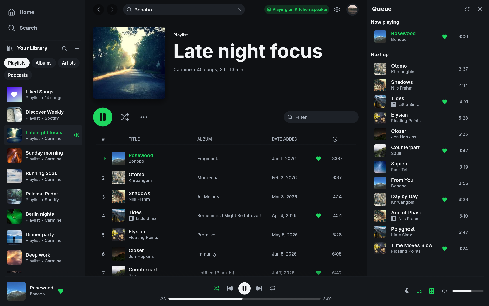

# snoop

a mac-first fork of [fastpotify](https://github.com/crmne/fastpotify): native, lightweight spotify client built with rust, [egui](https://github.com/emilk/egui), and [librespot](https://github.com/librespot-org/librespot). zero chromium, instant startup, minimal memory footprint, and dialed in for macos.



## what makes it mac-first

- **unified transparent titlebar:** fullsize content view with native traffic light controls cleanly integrated into the sidebar header
- **now playing everywhere:** media keys, control centre, the lock screen, and the airpods pinch all drive snoop, cover art included
- **dracula pro visual language:** default palette tuned to dracula pro with high-contrast accents and matching app icon
- **macos shortcuts:** native `⌘` keybindings everywhere, including `⌘[` / `⌘]` for page history navigation
- **zero electron bloat:** starts in under a second and stays tiny in memory while playing gapless 320 kbps audio
- **nix flake + direnv:** reproducible dev environment out of the box

## memory footprint

measured on macos (apple silicon) during active playback:

| metric | snoop | official spotify client | difference |
| --- | --- | --- | --- |
| resident memory (rss) | ~255 mb | ~1,515 mb (~1.5 gb) | ~6x less |
| physical footprint | ~320 mb | ~811 mb | ~2.5x less |
| processes | 1 native binary | 7 (cef main + helpers) | 7x fewer |
| threads | ~35 | ~153 | ~4.4x fewer |

regular spotify runs multiple chromium helper processes for rendering, audio, network, and crash handling. snoop runs ui and audio in a single lightweight rust process with zero webview overhead.

## what it does

- **plays music locally:** acts as a native spotify connect receiver, gapless playback up to 320 kbps with optional normalization and audio cache
- **controls your devices:** switch playback between speakers, phones, and computers directly from the device picker
- **lan speaker discovery:** finds local librespot / spotifyd instances over mdns and connects them to your account
- **full library & search:** playlists, liked songs, albums, artists, podcasts, and unified search
- **queue management:** queue side panel or dedicated full page, reorder and add from any row menu
- **lyrics panel:** synchronized and unsynchronized lyrics following playback
- **album art tinting:** surfaces dynamically take a subtle tint from the active album cover

## install & development

with nix and direnv:

```bash
direnv allow
cargo run
```

or build with cargo directly:

```bash
cargo run --release
```

to build a real `Snoop.app` (macos routes media keys, control centre, and the lock screen only to bundled apps, so `cargo run` does not get them):

```bash
cargo build --release
packaging/macos/bundle.sh target/release/snoop Snoop.app 0.2.0
```

the bundle is ad-hoc signed by default. set `CODESIGN_IDENTITY` to a developer id to sign it for distribution.

titles in a script inter does not cover (chinese, japanese, korean, arabic,
hebrew, thai, the indic scripts and a dozen more) are drawn with a face
borrowed from the system, nothing is bundled. macos ships faces for the
common ones. on linux install the matching noto families, for example
`noto-fonts` and `noto-fonts-cjk`, or those titles stay empty boxes.

to run with sample demo data (no spotify login needed):

```bash
cargo run --features demo -- --demo --demo-page playlist:pl1 --demo-show queue
```

## controlling it from outside

on linux, snoop is an mpris player, so `playerctl --player=snoop play-pause` already works.

macos and windows have no such bus, so the same verbs are subcommands. they talk to the instance already running and print nothing on success:

```
snoop play-pause          snoop volume 40
snoop play                snoop volume-up [percent]
snoop pause               snoop volume-down [percent]
snoop next                snoop mute
snoop previous            snoop shuffle
snoop seek 15             snoop repeat
snoop seek -- -15         snoop show
snoop now-playing [--raw]
```

`now-playing` prints one readable line; `--raw` prints the fields tab-separated (state, title, artists, album, position_ms, duration_ms, volume, shuffle, repeat) for scripts. a verb exits non-zero when snoop is not running.

that is enough for a launcher such as raycast or alfred to drive playback through its own script commands.

## keyboard shortcuts

| shortcut | what it does |
| --- | --- |
| `Space` | play or pause |
| `⌘←` / `⌘→` | previous or next track |
| `Shift+←` / `Shift+→` | seek 10 seconds |
| `⌘↑` / `⌘↓` | volume up or down |
| `M` | mute or unmute |
| `S` / `R` | shuffle / cycle repeat |
| `Q` or `⌘U` | toggle queue panel |
| `L` | toggle lyrics panel |
| `⌘F` or `/` | search |
| `⌘[` / `⌘]` or `⌥←` / `⌥→` | back or forward |
| `⌘Shift+H` / `⌘L` | home / liked songs |
| `⌘Shift+A` / `⌘Shift+B` | playing artist / album |
| `⌘,` | settings |
| `⌘/` | keyboard shortcuts |
| `⌘Q` | quit |

## settings

configuration lives in `~/Library/Application Support/com.dappermint.snoop/settings.json` on macos: connect device name, bitrate, normalization, theme, and audio cache size. caches live under `~/Library/Caches/com.dappermint.snoop` and can be wiped anytime without losing your session.

## credits

forked from [crmne/fastpotify](https://github.com/crmne/fastpotify). stands on [librespot](https://github.com/librespot-org/librespot), [egui](https://github.com/emilk/egui), [dracula pro](https://draculatheme.com/pro), [inter](https://rsms.me/inter/), and [lucide](https://lucide.dev) icons.

snoop is an independent project and is not affiliated with Spotify AB.

licensed under [MIT](LICENSE).
